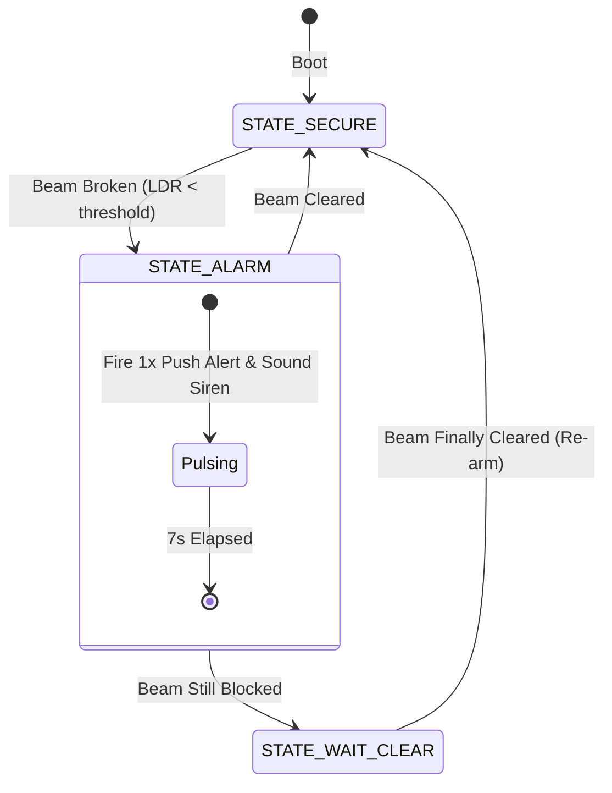

# R-SEC Smart Alarm

An ESP32-based laser tripwire security alarm that sends push notifications to your phone via Blynk IoT when someone crosses the perimeter.

Most basic Arduino laser alarm tutorials have two annoying issues: they freeze inside `delay()` loops, and they spam your phone with dozens of notifications every second if someone blocks the beam. This project fixes both:

1. **Non-blocking timing:** Sensor polling, sirens, and telemetry run on independent timers without stalling the loop.
2. **Anti-spam latch:** When the beam breaks, it fires **one** alert and pulses the siren for 7 seconds. If the beam stays blocked after 7 seconds, the siren stops and waits until the beam clears before re-arming—no notification spam.
3. **Bandwidth-friendly telemetry:** Live sensor graphs are throttled to 1 Hz to stay well within Blynk's free-tier rate limits.
4. **Offline fallback:** If Wi-Fi drops, the local siren and LCD keep working. The ESP32 will quietly try to reconnect in the background every 30 seconds.

---

## How the Alarm Logic Works



- **Standby (`STATE_SECURE`):** Beam intact. LCD shows current sensor reading.
- **Alarm (`STATE_ALARM`):** Beam broken. Sends a single Blynk push event, lights the dashboard LED, and pulses the buzzer and red LED at 2.4 kHz for 7 seconds.
- **Wait Clear (`STATE_WAIT_CLEAR`):** The 7-second siren finished, but the beam is still obstructed. The siren silences to save power, and the system waits until the beam is restored before re-arming.

---

## Parts List

| Part | Qty | Notes |
| :--- | :---: | :--- |
| **ESP32 DevKit v1** | 1 | 30-pin or 38-pin board |
| **LDR (Photoresistor)** | 1 | e.g. GL5528 |
| **10kΩ Resistor** | 1 | Pull-down resistor for the LDR voltage divider |
| **Laser Diode Module** | 1 | Standard 650nm red laser (5V or 3.3V) |
| **16x2 LCD with I2C Backpack** | 1 | Default address is usually `0x27` (or `0x3F`) |
| **Passive Buzzer** | 1 | **Must be passive** — active buzzers cannot play the startup chime or frequency changes from `tone()` |
| **Red LED + 220Ω Resistor** | 1 | Visual alarm indicator |
| **Breadboard & Jumpers** | 1 set | For wiring |

---

## Wiring

| Component Pin | ESP32 GPIO | Description |
| :--- | :---: | :--- |
| **LDR Output** | `GPIO 32` | Middle junction between LDR and 10kΩ resistor |
| **Buzzer (+)** | `GPIO 4` | Buzzer signal / positive (negative to GND) |
| **LED (+)** | `GPIO 27` | Through 220Ω resistor to anode (cathode to GND) |
| **LCD SDA** | `GPIO 21` | I2C Data |
| **LCD SCL** | `GPIO 22` | I2C Clock |
| **LCD VCC / GND** | `VIN (5V) / GND` | Power supply for LCD |

### LDR Voltage Divider Schematic

```text
       3.3V
         |
       [ LDR ]
         |
         +--------> GPIO 32 (ADC1)
         |
      [ 10kΩ ]
         |
        GND
```

---

## Blynk IoT Setup

### 1. Template & Datastreams
Create a new template in the [Blynk Web Console](https://blynk.cloud/) for **ESP32** via **WiFi**, then add three datastreams:

- **`V1`** (`String`): Security status text ("Sistem Aman...", "AWAS PENYUSUP!")
- **`V2`** (`Integer`, 0–4095): Real-time light sensor value for graphs
- **`V3`** (`Integer`, 0–1): Virtual LED indicator

### 2. Notification Event
In the **Events** tab, create an event:
- **Event Name:** `Intrusion Warning`
- **Event Code:** `peringatan_bahaya`
- Turn on **Send event to timeline** and **Deliver push notifications as alerts**.

---

## Getting Started

This project is configured for **PlatformIO**.

### 1. Clone & Set Up Secrets
```bash
git clone https://github.com/Jejekdf/r-sec-smart-alarm.git
cd r-sec-smart-alarm

# Copy the config template (config.h is already in .gitignore)
cp include/config.example.h include/config.h
```

Open `include/config.h` and paste your credentials:
```cpp
#define BLYNK_TEMPLATE_ID   "TMPLxxxxxx"
#define BLYNK_TEMPLATE_NAME "Project Sentinel"
#define BLYNK_AUTH_TOKEN    "YourTokenHere"

#define WIFI_SSID           "Your_WiFi_Name"
#define WIFI_PASS           "Your_WiFi_Password"
```
*(Note: ESP32 only connects to 2.4 GHz Wi-Fi networks).*

### 2. Build & Flash
Connect your ESP32 via USB and run:

```bash
# Build
pio run

# Flash to board
pio run -t upload

# Open serial output at 115200 baud
pio device monitor
```

If you prefer VS Code, open the project folder with the **PlatformIO IDE** extension installed and click the **Upload** arrow in the bottom status bar.

---

## Calibration & Practical Tips

- **Adjusting sensitivity:** By default, `safeThreshold = 1500` in `src/main.cpp`. When the laser hits the LDR, the reading will usually sit between `2500` and `4000`. When blocked by a hand or body, it drops below `1000`. Adjust `safeThreshold` midway between your direct-hit reading and room light reading.
- **Preventing false alarms from room lighting:** Slip a short piece of dark heat-shrink tubing or a black straw over the LDR head. This shields it from overhead room lights and sunlight so only direct laser light enters.
- **LCD address:** If your LCD backlight turns on but displays no characters, check the blue potentiometer on the back of the backpack for contrast. If it still doesn't show text, change `0x27` to `0x3F` in `src/main.cpp`.
- **Buzzer check:** If you get faint clicking instead of a clean tone, verify you're using a passive buzzer. Active buzzers have their own fixed oscillator and will sound distorted when driven by PWM or `tone()`.

---

## License

MIT